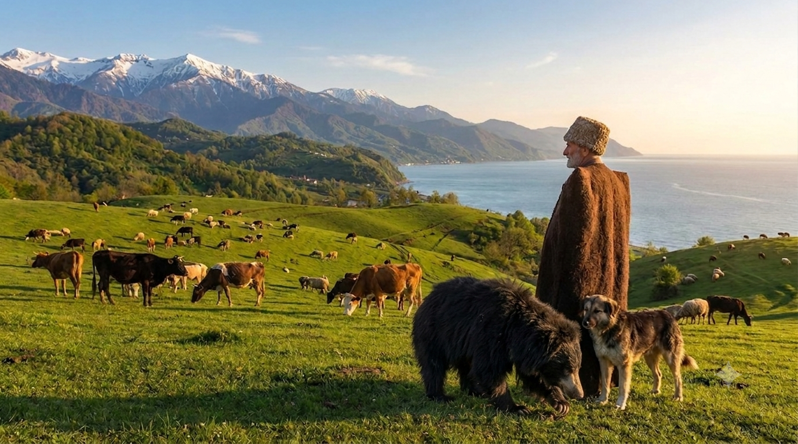
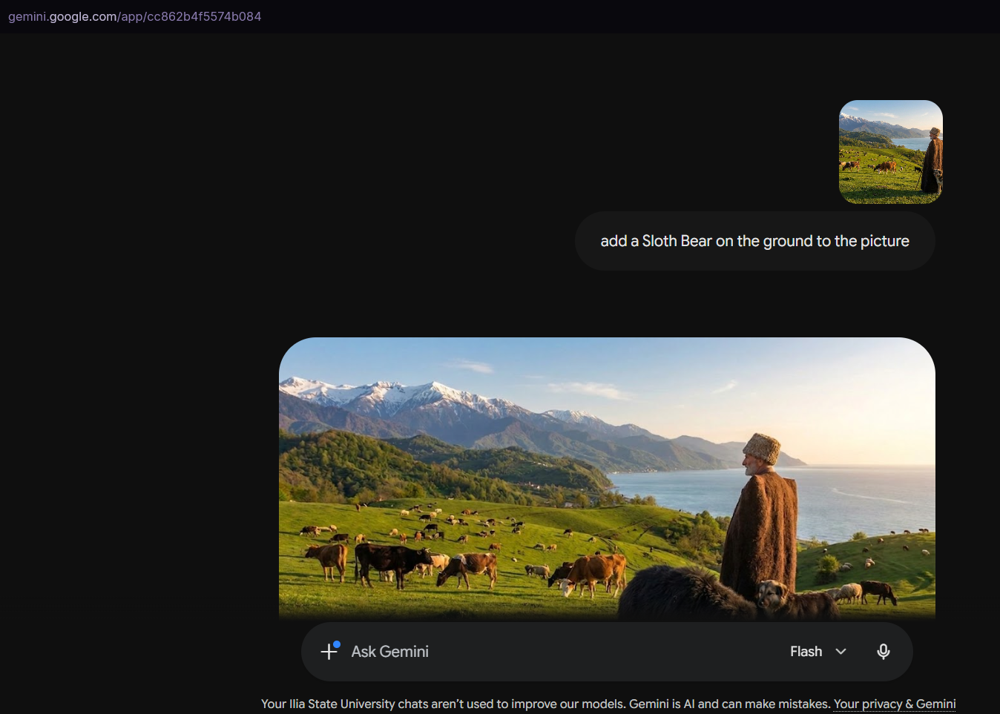

Task 1: 

Task 2:
To implement task 1, user first has to sign up to the Gemini AI chatbot at gemini.google.com via their preferred email. After creating the account and logging into it, user can come up with their preferred prompt to add the Sloth Bear to the given picture however they want, for example: "add a Sloth Bear on the ground to the picture". 

After some time AI will give back the picture with added Sloth Bear in it.

Initial Picture:
[Initial Picture](picture-template.jpeg)

AI generated picture adding sloth bear:
[AI Generated](Gemini_Generated_Picture.png)

Task 3:
[Graph](Graph.png)
